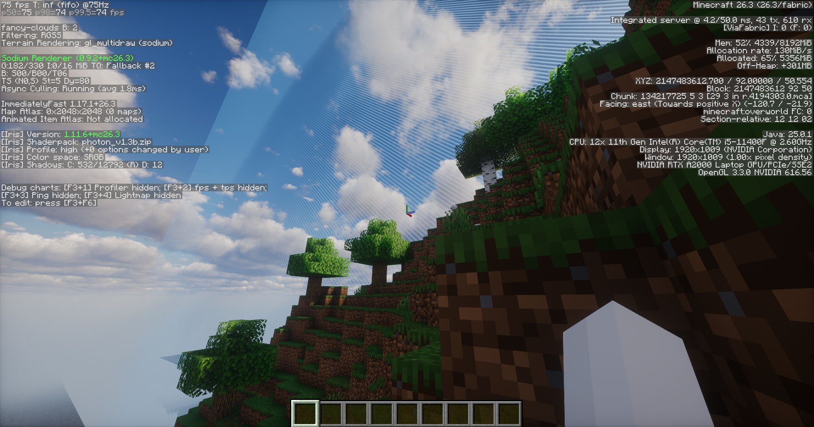

# Limit Breaker

---

**A mod that break the Vanilla Barrier, Explore the True 32-Bit Frontier.**

For over a decade, Minecraft players have been artificially confined to a 30,000,000 block radius. This was never the true edge of the world—it was a hardcoded safety measure designed to hide the mathematical breakdown of the game's engine. Limit Breaker completely shatters this artificial barrier, unleashing the underlying rendering and world-generation systems to reach the absolute 32-bit integer limit of the universe: **X/Z: 2,147,483,647**.

Reaching the two-billion mark requires far more than simply removing a world border command. In vanilla Minecraft, crossing the extreme integer threshold triggers catastrophic engine failures. Spatial partitioning systems collapse into infinite recursive loops (`StackOverflowError`), bounding boxes invert, and the frustum culling engine completely drops meshes—leaving players stranded on invisible ghost blocks. Furthermore, background world-generation threads panic and crash the server when attempting to query neighbor chunks that mathematically cannot exist.

We didn't just remove the wall; we surgically rebuilt the mathematics that govern the game's spatial awareness.

When Minecraft updates, Limit Breaker will be updated and released extremely quickly.

---
## Core Features & Technical Fixes

*   **The 2.14 Billion Expansion:** Expands the world border from a mere 30 million to the absolute physical maximum of the 32-bit integer limit. The true Far Lands are finally accessible.
*   **Octree & AABB Overhaul:** Meticulously intercepts and patches 32-bit integer overflows within `BoundingBox` calculations and `Octree` spatial rendering. This permanently eradicates the recursive infinite loops and memory leaks that plague vanilla clients at extreme distances.
*   **Flawless Edge Rendering:** Rewrites `RenderSection` logic to gracefully handle coordinate wrapping. Meshes at the edge of reality are properly baked and rendered—eliminating the vanilla bug where chunks turn into invisible, unrendered air blocks.
*   **World Generation Safeguards:** Hardens `WorldGenRegion` limits to safely clamp neighbor-chunk queries. Ores, structures, and biome decorations generate smoothly without crashing the server thread when searching for non-existent chunks beyond the 32-bit boundary.
*   **Remake SectionPos, BlockPos, ChunkPos:** We used higher-level mathematical code to fix the artificial limit that caused crashes when `X/Z > 33,554,432`; such as:`HashMath`, this code also prevents the vast majority of chunk creation errors!

---
## Future Development
* **Moving the latest version of the Far Lands to 12,550,821:** the latest version generates at `X/Z 18,087,643,689,552,203,596,431,37` —an astronomical figure. (Although, unlike the sponge-like structure of the old Far Lands, the current version consists of solid terrain and looks absolutely hideous.)
* **Reintroducing beta 1.8 Perlin noise:** Restores the old "sponge-like" terrain, allowing players to naturally explore the Borderlands and Farther Lands.

---
## Engineered for Extreme Exploration

Limit Breaker is a comprehensive rewrite of Minecraft's spatial mathematics. Whether you are a technical pioneer stress-testing the engine or an explorer seeking the literal edge of reality, this mod provides the rock-solid stability you need to go further than any vanilla player has gone before.

